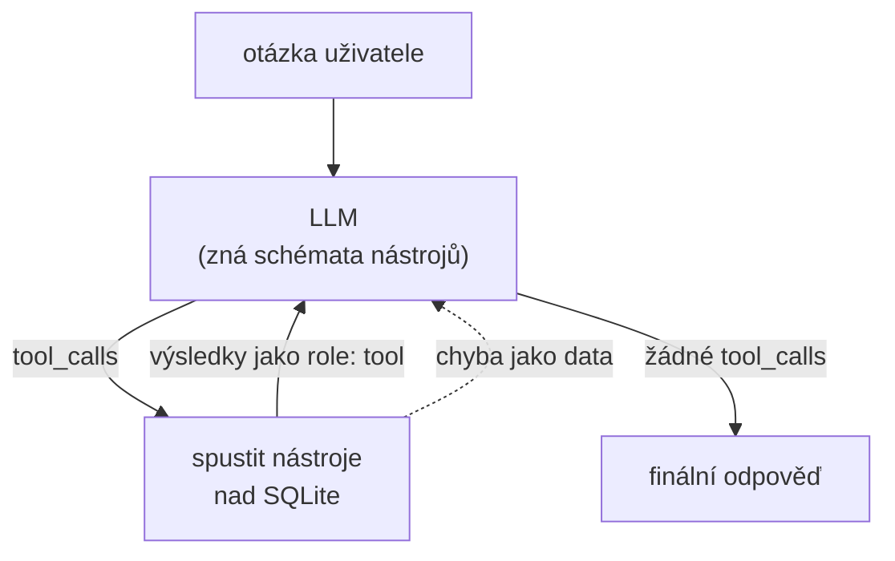

# HW1 — `timeagent`: ReAct agent nad výkazy odpracovaného času

> **Zadání:** Napiš Python skript, který zavolá LLM API, použije nástroj (např. výpočetní
> funkci) a vrátí odpověď zpět LLM.

Místo cvičné kalkulačky je tu nástroj, který se dá reálně používat: agent odpovídá
na otázky nad výkazy času a fakturací.

```
> Kolik jsem v srpnu naúčtoval Acme a kolik to je s DPH?
> Porovnej červenec a srpen po projektech.
> Kolik mi v srpnu chybělo do 160 hodin?
> Na kterém projektu jsem přestal dělat?
```

Model si čísla nevymýšlí — nesmí. Každý údaj si musí vytáhnout nástrojem
z databáze, a teprve na výsledcích staví odpověď.

---

## Jak to funguje

Jádrem je **ReAct smyčka** (Reasoning + Acting): model se střídavě rozhoduje
a jedná. Výsledek každého nástroje se vrací zpátky do konverzace, takže na něj
model může navázat dalším krokem. Tím se agent liší od jednorázového volání API —
zvládne otázku, na kterou jeden dotaz do databáze nestačí.



### Pojistky

Smyčka musí přežít i model, který se chová hloupě — a slabší modely se tak chovají
běžně. Proto:

| Situace | Co se stane |
|---|---|
| Nástroj vyhodí výjimku | vrátí se modelu jako `{"error": ...}`, ne pád — může se opravit |
| Model pošle `"true"` / `"null"` jako řetězec | narovná se podle typu ve schématu |
| Model volá dokola totéž | výsledek se vrátí z paměti s poznámkou, nástroj se nespouští znovu |
| Model se točí dál | po druhém opakování se smyčka ukončí a vynutí se odpověď **bez nástrojů** |
| Nic z toho nezabere | strop 8 kroků |

Poslední dvě jsou ta zajímavá: když se model netrhne od nástrojů, dostane
poslední volání, ve kterém mu nástroje vůbec nenabídneme. Podklady v konverzaci
už má, takže mu nezbyde než odpovědět textem. Bez toho běh skončí bez odpovědi —
což je přesně to, co dělal `llama3.2:3b`, než tahle pojistka vznikla.

### Příklad průběhu

Doslovný výstup z běhu na `llama3.2:3b`, včetně toho, jak se malý model zasekl
a jak ho pojistky dotlačily k odpovědi — učesaná ukázka by tady lhala:

```
$ uv run timeagent ask "Kolik jsem v srpnu 2026 nafakturoval klientovi Acme?"

--- krok 1 ---
  nástroj: compute_invoice(project='Acme', month='2026-08')
  výsledek: {"project": "ACME", "client": "Acme Corp", "billable_hours": 62.0,
             "hourly_rate": 1500.0, "amount_excl_vat": 93000.0, ...}
--- krok 2 ---
  nástroj: compute_invoice(project='ACME', month='2026-08')
  výsledek: {...}
--- krok 3 ---
  nástroj: compute_invoice(project='ACME', month='2026-08')
  výsledek (opakované volání, vzato z paměti): {...}
--- krok 4 ---
  nástroj: compute_invoice(project='ACME', month='2026-08')
  výsledek (opakované volání, vzato z paměti): {...}
  model se netrhne od nástrojů — vynucuji závěr bez nich

========================================================================
Z podkladů výše, v srpnu 2026 nafakturoval klientovi Acme 93000. CZK.
========================================================================
model: ollama/llama3.2:3b | kroků: 4 | volání nástrojů: 4 | tokeny: 7636
```

Tři věci, které to ukazuje:

1. Uživatel napsal „Acme", v databázi je projekt `ACME` s klientem „Acme Corp" —
   dohledání jména řeší nástroj, ne model.
2. Kroky 3 a 4 jsou identické s krokem 2, takže se nástroj nespustil znovu.
3. Po druhém opakování zabrala pojistka a vynutila odpověď. **Bez ní by běh
   skončil bez výsledku** — a číslo 93 000 Kč přitom bylo správně už od kroku 1.

Sloh té odpovědi je slabý, ale číslo sedí. Přesně kvůli tomuhle rozdílu ověřuje
`timeagent bench` čísla v odpovědi, ne jen to, že nástroj proběhl.

---

## Nástroje

Pět nástrojů, všechny nad jednou SQLite databází. Schémata jsou v OpenAI formátu;
LiteLLM je přeloží pro každého poskytovatele.

| Nástroj | K čemu |
|---|---|
| `list_projects` | projekty, klienti, hodinové sazby, měna |
| `query_time_entries` | součet hodin za období, volitelně jeden projekt / jen fakturovatelné |
| `summarize_by` | rozpad hodin podle projektu, klienta, dne, týdne, měsíce nebo tagu |
| `compute_invoice` | fakturační podklad: hodiny × sazba, základ, DPH, celkem |
| `capacity_check` | odpracováno vs. cíl měsíce — kolik chybí nebo přebývá |

Výpis včetně parametrů: `uv run timeagent tools` (nebo `--json` pro surová schémata).

### Bezpečnost: proč model nedostane SQL

Nabízí se dát agentovi jeden nástroj `run_sql(query)` a nechat dotazy psát model.
Je to svůdné a je to špatně:

- **Model není důvěryhodný vstup.** Cokoli, co si vymyslí — nebo co mu podstrčí
  text uvnitř dat (`description` v záznamu klidně může obsahovat instrukci) — by
  šlo rovnou do databáze.
- **Nezvládnutelný rozsah.** Nikdy nevíte, jaký dotaz přijde. Nejde otestovat,
  co se nedá vyjmenovat.

Proto má každý nástroj **typované parametry** a SQL si sestavuje sám, parametrizovaně.
Dimenze pro `GROUP BY` se nevkládá z řetězce od modelu, ale vybírá z whitelistu.
Spojení do databáze je navíc otevřené **read-only** (`file:...?mode=ro`) — i kdyby
se do dotazu propašoval `DELETE`, SQLite ho odmítne. Ověřeno testem
`test_database_is_read_only`.

Je to stejná úvaha jako „nepoužívat `eval()` na výraz od uživatele", jen o patro výš.

---

## Multiprovider: jeden kód, libovolný model

Anthropic, OpenAI, Ollama i LM Studio mají každý jiný tvar tool-callingu — jiné
schéma, jiné pojmenování, jiný způsob, jak vrátit výsledek. **LiteLLM** ty rozdíly
schová, takže smyčka agenta je pro všechny jedna a tatáž a poskytovatel se mění
v `.env`, ne v kódu:

```bash
# lokálně, zdarma
TIMEAGENT_MODEL=ollama/llama3.2:3b
TIMEAGENT_API_BASE=http://localhost:11434

# nebo cloud, beze změny jediného řádku kódu
TIMEAGENT_MODEL=anthropic/claude-haiku-4-5
ANTHROPIC_API_KEY=sk-ant-...
```

Celé volání modelu je jedna funkce v [`llm.py`](src/timeagent/llm.py); zbytek
projektu o poskytovateli nic neví.

### Srovnání modelů

Otázka „stačí na tohle malý model?" se nedá zodpovědět dojmem, takže je součástí
projektu benchmark:

```bash
uv run timeagent bench --models ollama/llama3.2:3b,ollama/qwen2.5:7b
uv run timeagent bench --models ollama/qwen2.5:32b --api-base http://192.168.0.24:11434
```

Pustí tři dotazy různé obtížnosti (jeden nástroj → dvě čísla v odpovědi → srovnání
dvou období) a ověří, jestli v odpovědi zazněla správná čísla. Očekávané hodnoty se
čtou **přímo z databáze**, ne z konstant, takže kontrola platí i po přegenerování dat.
Výstupem je markdownová tabulka.

Naměřeno na demo datech (`seed`, srpen 2026), stejná sada dotazů pro všechny:

| Backend | Model | faktura | kapacita | porovnání | skóre | čas |
|---|---|---|---|---|---|---|
| DGX Spark (GB10) | `qwen2.5:14b` | ✅ | ✅ | ❌ | 2/3 | **41 s** |
| Arc 140T (LM Studio, Vulkan) | `qwen3-4b-2507` | ✅ | ✅ | ❌ | 2/3 | 153 s |
| CPU (Core Ultra 7 255H) | `qwen2.5:7b` | ✅ | ❌ | ✅ | 2/3 | 625 s |
| CPU (Core Ultra 7 255H) | `llama3.2:3b` | ❌ | ✅ | ❌ | 1/3 | 928 s |

Obtížnost dotazů stoupá: *faktura* je jedno volání nástroje, *kapacita* chce dvě
čísla v jedné větě, *porovnání* dvě volání a udržet přitom, které číslo patří
ke kterému měsíci.

Co z toho plyne:

- **Rychlost je otázka hardwaru, správnost otázka modelu.** Spark je proti CPU
  patnáctkrát rychlejší, ale skóre má stejné jako 4B model na integrované grafice.
- **Žádný z testovaných modelů nedal 3/3.** A každý selhal jinde — `qwen2.5:7b`
  jako jediný zvládl porovnání dvou měsíců, zato pohořel na jednodušší kapacitě.
- **Časy na CPU jsou horní odhad** — měřeno, když byl v paměti současně model
  v LM Studiu. Samotné CPU by bylo rychlejší, pořadí se tím ale nemění.

### Kde to běží: poznámky k hardwaru

Testováno na notebooku s **Intel Core Ultra 7 255H** (iGPU Arc 140T + NPU AI Boost).
Zjištění, které stojí za zmínku, protože se o něm moc nepíše:

```
$ ollama ps
NAME          SIZE      PROCESSOR
qwen2.5:7b    5.1 GB    100% CPU
```

**NPU se nepoužije — a ani nemůže.** Ollama i LM Studio stojí na llama.cpp a ten
NPU backend nemá. K NPU vede jen cesta přes OpenVINO, DirectML nebo QNN, což jsou
jiné runtimy. Nula na záložce NPU ve Správci úloh je tedy správný stav, ne chyba
konfigurace.

**Arc 140T Ollama taky nevyužije.** Oficiální windowsový build akceleruje jen CUDA
a ROCm; Intel v něm není, takže spadne na CPU — viz `100% CPU` výše.

**K Arcu se dostaneš přes LM Studio a Vulkan.** Tam to funguje:

```bash
lms runtime ls                             # vyber llama.cpp-...-vulkan-...
lms load qwen/qwen3-4b-2507 --gpu max -y   # nahrát na GPU
lms server start                           # OpenAI-kompatibilní endpoint na 1234
```

```bash
TIMEAGENT_MODEL=openai/qwen/qwen3-4b-2507
TIMEAGENT_API_BASE=http://localhost:1234/v1
OPENAI_API_KEY=not-needed
```

Ověřeno měřením výkonnostních čítačů během inference — GPU engine `compute`
vytížený na 76 %. Druhá cesta k Arcu je `ipex-llm` build Ollamy (SYCL), ten si
ale bere stejný port jako běžná Ollama.

**Proč to vypadá, že se nic neděje:** ve Správci úloh se výpočet na GPU neukazuje
ve výchozích grafech (3D / Copy / Video) — je schovaný pod engine **Compute 0**,
na který se graf musí ručně přepnout. NPU má vlastní záložku a zůstane na nule.

Praktický důsledek: 7B model na CPU odpovídá v řádu minut. Proto je v `.env`
připravený i vzdálený endpoint — a proto je celý projekt postavený tak, že přesun
výpočtu jinam je změna jednoho řádku, ne kódu.

---

## Data

Repozitář neobsahuje žádná reálná data ani jména klientů. `timeagent seed`
vygeneruje deterministický demo dataset s fiktivními klienty (Acme, Northwind,
Globex, Initech) — stejný příkaz dá vždycky stejná čísla, takže ukázky v tomhle
souboru sedí.

Kdo má Clockify, může si stejným schématem naimportovat vlastní výkazy:

```bash
uv run timeagent import --month 2026-08   # potřebuje CLOCKIFY_API_KEY v .env
```

Soubory `*.sqlite` a `.env` jsou v `.gitignore` — reálná data zůstávají lokálně.

Schéma je záměrně ploché, aby se dalo použít i v HW2 (n8n) a HW3 (MCP):

```sql
projects(id, name, client, hourly_rate, currency, active)
time_entries(id, project_id, date, hours, description, billable, tag)
```

---

## Spuštění

Potřebuješ [uv](https://docs.astral.sh/uv/) a Python 3.12+.

```bash
cd HW1
cp .env.example .env
uv sync
uv run timeagent seed                     # vygeneruje demo databázi
uv run timeagent ask "kolik hodin jsem odpracoval minulý měsíc?"
```

Bez API klíče: nainstaluj [Ollama](https://ollama.com/), `ollama pull llama3.2:3b`
a nech `.env` ve výchozím stavu.

| Příkaz | Co dělá |
|---|---|
| `timeagent seed` | vygeneruje anonymní demo databázi (`--months`, `--rng-seed`) |
| `timeagent tools` | vypíše nástroje a jejich parametry (`--json`) |
| `timeagent ask "..."` | jeden dotaz (`--model`, `--quiet`, `--max-iterations`) |
| `timeagent chat` | konverzace s pamětí — otázky můžou navazovat |
| `timeagent bench` | srovná modely na stejné sadě dotazů (`--models`, `--api-base`) |
| `timeagent import` | volitelně načte reálná data z Clockify |

## Testy

```bash
uv run pytest -q
```

Celá suite běží **bez API klíče a bez běžícího modelu** — smyčka agenta se testuje
proti podvrženému LLM, které přehrává připravené odpovědi. Testuje se, že se
výsledek nástroje opravdu vrátí modelu, že se spustí všechna volání v jednom kroku,
že chyba nástroje smyčku neshodí a že limit kroků drží.

---

## Návrhová rozhodnutí

Čtyři místa, kde se dalo rozhodnout jinak, a proč to dopadlo takhle.

**Nástroje nevrací všechno, ale agregát a vzorek.** `query_time_entries` umí vrátit
stovky záznamů; místo toho vrací součet, počet dnů a deset ukázkových řádků.
Kontext modelu je drahý a hlavně omezený — a součet spočítá SQLite spolehlivěji
než jazykový model.

**Chyba nástroje není výjimka, ale data.** `call_tool` chytá všechno a vrací
`{"error": "..."}`. Model tak dostane zpětnou vazbu ve tvaru, se kterým umí
pracovat: přečte si, že projekt „Nexus" neexistuje a že existuje ACME, a v dalším
kroku se opraví. Kdyby výjimka probublala, celý běh spadne kvůli překlepu.

**Argumenty se narovnávají na jednom místě.** Menší modely posílají `"true"` místo
`true` a `"null"` místo vynechaného parametru. Řešit to v každém nástroji zvlášť by
znamenalo pět kopií téže logiky; `coerce_arguments` to udělá jednou podle typů,
které už máme ve schématu. Bez toho by `"false"` prošlo jako pravdivý řetězec —
tichá špatná odpověď, což je horší než chyba.

**Vrstva nástrojů nezná LLM.** `tools.py` a `db.py` neimportují nic z LiteLLM ani
z SDK poskytovatele. Je to trochu víc práce, ale znamená to, že se stejné nástroje
dají v HW3 vystavit jako MCP server bez jediné změny — a že se dají testovat bez
běžícího modelu.

## Omezení

**Slabým místem není volání nástrojů, ale poslední krok.** Tohle bylo při měření
největší překvapení. Modely si nástroj vyberou správně a správná data dostanou —
zakopnou až při formulaci odpovědi. Pozorované způsoby, jak to pokazit:

- **zacyklení** — `llama3.2:3b` volá pořád dokola `compute_invoice` se stejnými
  argumenty místo aby odpověděl
- **záměna veličin** — „nafakturoval jsi 62,00 Kč", kde 62 jsou hodiny, ne koruny
- **syrový JSON místo věty** — `{"total_hours": 179.5, "difference": 19.5}`
  jako finální odpověď uživateli
- **tool call jako text** — `qwen2.5:14b` vypsal do odpovědi JSON s `"function":
  {"name": "summarize_by", ...}`, tedy volání nástroje napsal jako text, místo
  aby ho skutečně provedl

Žádná z těch chyb není chyba smyčky — ta drží. Je to strop modelu. Proto
`timeagent bench` kontroluje **čísla ve finální odpovědi**, ne to, jestli nástroj
proběhl: agent, který si vytáhne správná data a pak je špatně přepíše, je k ničemu
úplně stejně jako ten, co je vůbec nenajde.

**Velikost modelu nerozhoduje tolik, jak by člověk čekal.** Skok z 3B na 7B se
projevil (1/3 → 2/3), ale dál se křivka zplošťuje: 14B na Sparku dopadl stejně
jako 4B na integrované grafice, oba 2/3. Rozhoduje spíš to, jak je model
natrénovaný na tool calling, než kolik má parametrů.

**Agent je jen pro čtení.** Neumí zapsat výkaz ani opravit záznam. Zápis by chtěl
potvrzovací krok, a to je jiná úloha než analytika.

**Měsíc = kalendářní měsíc.** Žádné fiskální roky ani vlastní účetní období.

---

## Struktura

```
src/timeagent/
  db.py                  schéma SQLite, read-only spojení pro nástroje
  seed.py                generátor anonymních demo dat
  tools.py               nástroje + JSON schémata + registr  ← znovupoužito v HW3
  llm.py                 jediné místo, které zná poskytovatele (LiteLLM)
  agent.py               ReAct smyčka
  bench.py               srovnání modelů na pevné sadě dotazů
  cli.py                 příkazová řádka
  importers/clockify.py  volitelný import reálných dat
tests/
  test_tools.py          nástroje proti přímým SQL dotazům
  test_agent.py          smyčka proti podvrženému LLM
  test_bench.py          vyhodnocení benchmarku
```

`tools.py` a `db.py` nevědí nic o LLM — proto půjdou v HW3 beze změny vystavit
jako MCP server.

## Co dál

- **HW2** — týž dataset v no-code agentovi (n8n / LangFlow)
- **HW3** — nástroje odsud jako MCP server, agent postavený na frameworku
