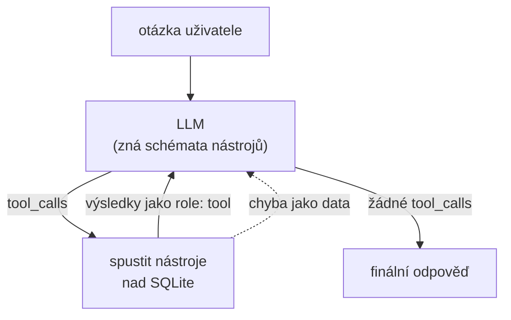
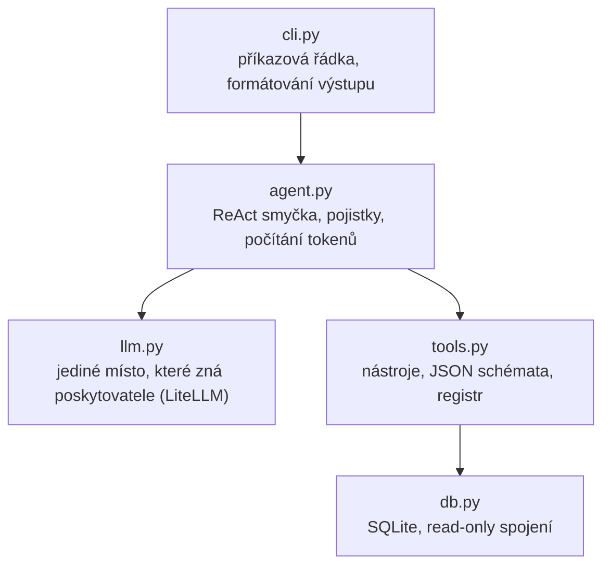

# Architektura

## Co je na tom agentního

Jednorázové volání LLM vypadá takhle: pošlu otázku, dostanu text. Když je odpověď
v databázi, model si ji vymyslí, protože do databáze nevidí.

Agent přidá druhou možnost: model může místo odpovědi **požádat o zavolání
nástroje**. Program nástroj spustí, výsledek vrátí zpátky do konverzace a zeptá
se znovu. Model tak staví odpověď na datech, ne na paměti — a protože se ptát může
opakovaně, zvládne i dotaz, na který jeden pohled do databáze nestačí.

Tomu střídání uvažování a jednání se říká **ReAct** (Reasoning + Acting).



Konkrétně na dotazu *„Kolik jsem v srpnu naúčtoval Acme?"*:

| Krok | Kdo | Co se stane |
|---|---|---|
| 1 | program | pošle model otázku + schémata pěti nástrojů |
| 2 | model | odpoví `tool_calls: [compute_invoice(project="Acme", month="2026-08")]` |
| 3 | program | narovná argumenty, spustí funkci, dostane `dict` |
| 4 | program | přidá výsledek do konverzace jako zprávu s rolí `tool` |
| 5 | model | tentokrát nechce nástroj, vrátí větu s čísly |

Kroky 2–4 se opakují, dokud model chce nástroje. Sekvenční dotaz („porovnej dva
měsíce") projde tou smyčkou dvakrát.

## Vrstvy



Závislosti vedou jen jedním směrem. **`tools.py` a `db.py` neimportují nic z LLM
světa** — nevědí, že existuje nějaký model. Díky tomu jdou testovat bez modelu
a v navazujícím úkolu vystavit jako MCP server beze změny.

Naopak `llm.py` neví nic o výkazech. Kdyby se doména vyměnila, mění se `tools.py`
a nic jiného.

## Volání modelu

Celý poskytovatel je schovaný v jedné funkci:

```python
litellm.completion(model=..., messages=..., tools=..., tool_choice="auto")
```

LiteLLM sjednocuje rozdíly mezi API. Anthropic používá `input_schema` a vrací
výsledky nástrojů jako zprávu role `user`; OpenAI má `parameters` a roli `tool`;
Ollama vrací argumenty rovnou jako `dict`, zatímco OpenAI jako JSON řetězec.
Smyčka agenta o těchto rozdílech neví — vidí vždycky OpenAI tvar.

Dvě věci `llm.py` řeší nad rámec LiteLLM:

- **`api_base` se cloudovým poskytovatelům neposílá.** Pro prefixy `anthropic/`,
  `gemini/`, `openrouter/`, `xai/` a `vertex_ai/` se ignoruje, protože jinak by
  zbytek po lokálním modelu poslal dotaz na localhost.
- **Hlavička `anthropic-workspace-id`** pro klíče navázané na identitu.

## Pojistky

Smyčka musí přežít i model, který se chová hloupě — a slabší modely se tak chovají
běžně. Každá z těchto pojistek vznikla z konkrétního selhání při měření, ne
z teorie; co které selhání předcházelo, je v [mereni.md](mereni.md).

| Situace | Reakce |
|---|---|
| Nástroj vyhodí výjimku | vrátí se modelu jako `{"error": ...}`, ne pád |
| Model pošle `"true"` / `"null"` jako řetězec | narovná se podle typu ve schématu |
| Model napíše volání nástroje jako text | rozpozná se, nástroj se spustí, výsledek jde zpět |
| Model volá dokola totéž | výsledek se vrátí z paměti s poznámkou |
| Model se točí dál | po druhém opakování se vynutí odpověď bez nástrojů |
| Nic z toho nezabere | strop 8 kroků |

### Chyba jako data

`call_tool` chytá všechno a vrací `{"error": "..."}`. Model tak dostane zpětnou
vazbu ve tvaru, se kterým umí pracovat: přečte si, že projekt „Nexus" neexistuje
a že existuje ACME, a v dalším kroku se opraví. Kdyby výjimka probublala, celý běh
spadne kvůli překlepu.

### Volání nástroje jako text

`qwen2.5` na Ollamě — ve 14B i 32B verzi shodně — místo skutečného `tool_calls`
občas vypíše jeho JSON do odpovědi:

```json
{"function": {"name": "summarize_by", "arguments": {"dimension": "project", ...}}}
```

Turn tím formálně skončí bez volání nástroje, takže by se tenhle text vrátil
uživateli jako výsledek. `parse_textual_tool_call` ho proto rozpozná (v obou
běžných tvarech), nástroj se spustí a výsledek jde do konverzace spolu s pokynem
používat příště tool calling. Nejvýš dvakrát za běh, aby se z berličky nestal
nekonečný cyklus.

Aby se za volání nepovažovala běžná odpověď, musí se jméno shodovat s registrem —
`{"total_hours": 179.5}` ani prostý text tou kontrolou neprojdou.

### Zacyklení a vynucený závěr

Výsledky nástrojů se v rámci jednoho dotazu drží v paměti. Když model požádá
o totéž se stejnými argumenty, nástroj se nespustí znovu; vrátí se uložený
výsledek s poznámkou, ať už odpoví. Když ani to nepomůže a dvě kola po sobě
nepřinesou nic nového, dostane model **poslední volání bez nástrojů** — podklady
už má, takže mu nezbude než odpovědět textem.

Bez téhle pojistky skončil `llama3.2:3b` bez odpovědi, přestože správné číslo měl
k dispozici už od prvního kroku.

Paměť se čistí na začátku každého `run()`, takže nová otázka smí nástroje volat
znovu.

## Bezpečnost: proč model nedostane SQL

Nabízí se dát agentovi jeden nástroj `run_sql(query)` a nechat dotazy psát model.
Je to svůdné, protože pak zvládne libovolný dotaz. A je to špatně.

**Model není důvěryhodný vstup.** Nejde jen o to, co si vymyslí sám: `description`
u záznamu je volný text, který se do modelu dostane jako součást výsledku
nástroje. Kdyby v něm někdo měl instrukci, model ji čte a může na ni reagovat.

**Nezvládnutelný rozsah.** Nedá se otestovat něco, co se nedá vyjmenovat.

Proto tři vrstvy nad sebou:

| Vrstva | Co odchytí |
|---|---|
| Typované parametry a JSON schéma | model neumí vyjádřit dotaz, na který jsme nemysleli |
| Whitelist pro `GROUP BY` | jediné strukturální místo je uzavřený výčet |
| Spojení v režimu `mode=ro` | i kdyby `DELETE` prošel, SQLite ho odmítne |

Hodnoty jdou vždy přes `?` placeholdery. Jediné místo, kde model ovlivňuje
strukturu dotazu, je `dimension` u `summarize_by` — a i tam se jeho řetězec do SQL
nedostane, slouží jen jako klíč do mapy:

```python
_DIMENSIONS = {"project": "e.project_id", "client": "p.client", ...}

if dimension not in _DIMENSIONS:
    raise ToolError(...)          # neznámou hodnotu odmítneme
expr = _DIMENSIONS[dimension]     # do SQL jde tohle, ne to, co poslal model
```

Read-only režim hlídá test `test_database_is_read_only`.

Cena za to je, že agent umí právě těch pět věcí. U nástroje na výkazy je to
přijatelné; kdyby měl zvládat libovolnou analytiku, byla by ta úvaha jiná.

## Odkud model ví, jaký je dnes den

Systémový prompt se skládá při každém běhu a obsahuje dnešní datum, den v týdnu
a aktuální měsíc. Bez toho model nemá jak přeložit „minulý měsíc" na konkrétní
období — v tréninkových datech dnešní datum není.

Zbytek promptu jsou pravidla vytažená z pozorovaných selhání: nepočítat zpaměti,
nepovinný parametr vynechat, nevolat dvakrát totéž, nepsat chybovou hlášku
do odpovědi.

## Co agent nedělá

- **Neumí zapisovat.** Žádný nástroj nemění data. Zápis by potřeboval potvrzovací
  krok, a to je jiná úloha než analytika.
- **Nemá dlouhodobou paměť.** `chat` drží konverzaci v procesu; po ukončení je
  pryč.
- **Nepracuje s fiskálními roky.** Měsíc znamená kalendářní měsíc.
- **Neběží paralelně.** Nástroje v jednom kroku se spouštějí postupně; u SQLite
  dotazů v řádu milisekund to nevadí.
