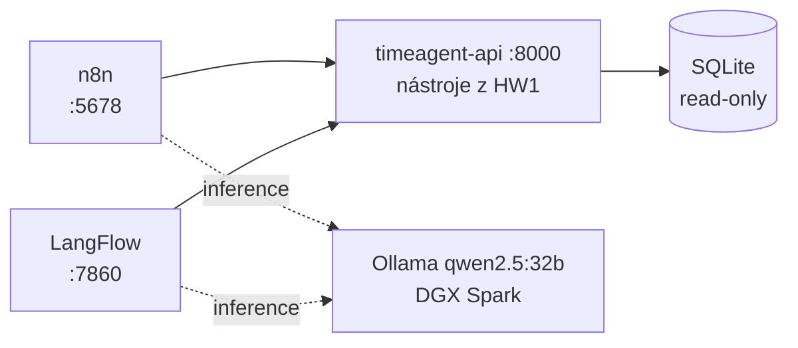

# HW2 — agent nad výkazy ve dvou no-code platformách

Zadání: agent v no-code platformě, který pracuje s databází. Odevzdává se JSON
s definicí workflow.

Odevzdávají se **dva** — n8n i LangFlow, obojí nad **týmiž nástroji z [HW1](../HW1/)**
a týmž modelem. Zadání žádá jednu platformu; druhá stojí za to, protože teprve
srovnání ukáže, čím se liší. Výsledky jsou v [docs/srovnani.md](docs/srovnani.md).

```
$ curl -s "localhost:8000/run/capacity_check?month=2026-08"
{"month":"2026-08","total_hours":142.0,"billable_hours":135.5, ...}

  n8n      » Kolik hodin jsem odpracoval v srpnu 2026?
           « V srpnu 2026 jsi odpracoval celkem 142 hodin, z toho 135,5
             fakturovatelných a 6,5 nefakturovatelných.
             [zdroj: capacity_check]

  LangFlow » stejná otázka, stejná čísla, jiná platforma
```

## Rychlý start

```bash
cd ../HW1 && uv run timeagent seed --months 21
cd ../HW2 && cp .env.example .env
docker compose up -d
./scripts/init-accounts.ps1
```

| | adresa |
|---|---|
| API s nástroji | http://localhost:8000/health |
| n8n | http://localhost:5678 |
| LangFlow | http://localhost:7860 |
| chat s agentem | http://localhost:5678/webhook/vykazy-agent-chat/chat |

Podrobnosti a pasti v [docs/instalace.md](docs/instalace.md).

## Dokumentace

| Dokument | Obsah |
|---|---|
| [docs/instalace.md](docs/instalace.md) | od nuly ke spuštěnému agentovi; pasti obou platforem |
| [docs/architektura.md](docs/architektura.md) | proč HTTP vrstva místo přímé databáze, vrstvy, pojistky proti nedoloženým číslům |
| [docs/srovnani.md](docs/srovnani.md) | **hlavní výstup** — n8n vs. LangFlow na stejné sadě dotazů, naměřeno |
| [docs/nasazeni-proxmox.md](docs/nasazeni-proxmox.md) | připravený přenos na server; co je potřeba rozhodnout |

## Co se odevzdává

```
flows/n8n/vykazy-agent.json        workflow: chat + Telegram do téhož agenta
flows/langflow/vykazy-agent.json   flow: pět vlastních komponent jako nástroje
```

Obojí se **generuje**, ne klikná — popisy nástrojů se berou z `GET /tools`, takže
se nemůžou rozejít s API. Popis nástroje je rozhraní pro model a v měření HW1
zvedlo jeho přepsání úspěšnost víc než výměna modelu za větší.

```
scripts/build_n8n_workflow.py      generátor n8n workflow
scripts/build_langflow_flow.py     generátor LangFlow flow (běží v kontejneru)
scripts/import_langflow_flow.py    nahraje flow a aktualizuje ho na místě
scripts/compare_platforms.py       srovnávací měření obou platforem
scripts/init-accounts.ps1 / .sh    vlastník v n8n, aby se nemuselo proklikávat
```

## Jak to drží pohromadě



`api/main.py` nemá **žádnou doménovou logiku** — importuje `timeagent.tools`
a jen ho obaluje. Obě platformy tak volají bit po bitu totéž a jejich srovnání
měří platformu, ne dvě implementace téhož. Image se staví
`pip install --no-deps ./hw1`, což je zároveň spustitelný důkaz, že vrstvení
z HW1 drží: kdyby `tools.py` sáhl do LLM světa, kontejner spadne na `ImportError`.

## Data a soukromí

Databáze se generuje lokálně (`timeagent seed`) s fiktivními klienty. Repozitář
neobsahuje žádná data ani tajemství; `.env` a `*.sqlite` jsou v `.gitignore`
a odevzdávané JSON jsou prověřené — token Telegram bota je v proměnné prostředí,
ne ve workflow.

## Vývoj

```bash
uvx ruff check .                                    # linter
python scripts/compare_platforms.py                 # srovnávací měření
python scripts/compare_platforms.py --only n8n      # jen jedna platforma
```
