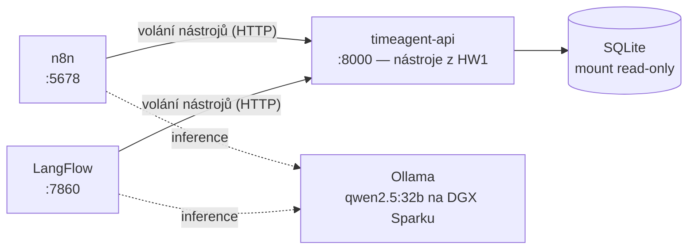
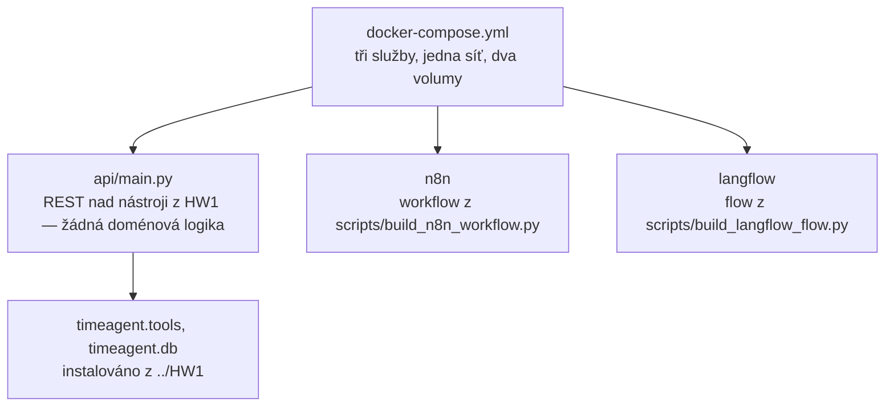

# Architektura

## Proč tu vůbec je HTTP vrstva

Zadání zní „agent v no-code platformě, který pracuje s databází". Nabízí se dát
platformě databázi přímo. Nejde to:

- **n8n nemá SQLite node v jádře.** Umí Postgres, MySQL a MSSQL.
- **LangFlow by v kontejneru neviděl cestu na hostiteli** a stejně by si dotazy
  psal znovu, vlastními komponentami.

Obojí ale umí zavolat HTTP. Nástroje z [HW1](../../HW1/) se proto vystaví jako
REST a obě platformy volají **bit po bitu totéž**.

Vedlejší efekty, kvůli kterým to stojí za to:

1. **Srovnání měří platformu**, ne dvě různé implementace téhož. Kdyby si každá
   platforma dotazy psala po svém, nešlo by rozhodnout, čí je chyba.
2. **Nulová duplicita logiky.** `api/main.py` nemá žádnou doménovou logiku —
   importuje `timeagent.tools` a jen ho obaluje.
3. **Most do HW3.** MCP server obalí tentýž registr nástrojů.

Cena je poctivá: přibývá třetí běžící služba a „no-code" agent stojí na kusu
Pythonu. U LangFlow je to ještě zřetelnější — tam jsou nástroje samy vlastní
Python komponenty, viz [srovnani.md](srovnani.md).

## Vrstvy

Závislosti vedou jedním směrem. `api` je jediná služba, která vidí databázi;
platformy se k ní dostanou jen přes pět pojmenovaných nástrojů.

### Důkaz, že vrstvení z HW1 drží

`api/Dockerfile` instaluje balíček z HW1 příkazem `pip install --no-deps ./hw1`.
To není úspora místa. HW1 deklaruje závislost na `litellm`, ale jeho
`tools.py` ani `db.py` z LLM světa nic neimportují — a `--no-deps` z toho dělá
**spustitelný test**: kdyby se to jednou porušilo, image spadne při startu na
`ImportError`.

## Rozhraní API

| Endpoint | K čemu |
|---|---|
| `GET /health` | ověří, že databáze existuje a jde otevřít; jinak 503 |
| `GET /tools` | schémata všech nástrojů v OpenAI tvaru |
| `GET /tools/{name}` | schéma jednoho nástroje |
| `POST /tools/{name}` | spustí nástroj, argumenty v těle — používá n8n |
| `GET /run/{name}?…` | totéž, argumenty v query stringu — používá LangFlow |

**Proč dvě cesty ke stejné věci.** LangFlow vystavuje modelu z komponenty API
Request jen URL (`tool_mode` mají pouze pole `url_input` a `curl_input`), takže
tělo POST požadavku sestavit neumí. GET varianta existuje kvůli tomu. Hodnoty
z query stringu jsou vždy řetězce; narovná je `coerce_arguments` z HW1 — táž
funkce, která v HW1 uklízela argumenty od malých modelů.

**Chyba se vrací jako data se stavem 200.** Není to nedbalost: `call_tool` chytá
výjimky a vrací `{"error": …}`, aby si model přečetl, co udělal špatně, a opravil
se. Kdyby tahle vrstva mapovala chyby na HTTP kódy, platforma by běh ukončila
jako selhání requestu a model by zpětnou vazbu nikdy neviděl.

## Pojistky proti nedoloženým číslům

Volání nástroje je rozhodnutí modelu. Nic ho k němu nenutí a `qwen2.5` ho občas
přeskočí — pak si čísla domyslí. Proti tomu stojí tři nezávislé vrstvy:

| Vrstva | Kde | Co odchytí |
|---|---|---|
| `note` v odpovědi nástroje | `HW1/src/timeagent/tools.py` | prázdný výsledek se pojmenuje včetně rozsahu dat, aby si model nulu nevyložil jako „pokračuj v trendu" |
| pravidlo v systémovém promptu | oba generátory | zákaz uvádět čísla, která nevrátil nástroj, a přebírat je z dřívější konverzace |
| uzel **Ověř zdroj** | n8n workflow | podívá se, které tool uzly v běhu opravdu proběhly; když odpověď tvrdí čísla a nástroj neproběhl, odpověď se neodešle |

Třetí vrstva je jediná, která nespoléhá na kázeň modelu — kontroluje běh, ne
text. Ke každé doložené odpovědi navíc připojí `[zdroj: capacity_check]`. Je to
zároveň jediný důvěryhodný způsob, jak odpovědět na otázku „odkud to máš":
sám model na ni odpovídá dojmem.

Historie těch selhání je v [srovnani.md](srovnani.md).

## Co je vědomě odložené

- **API zůstává v Pythonu.** Přepis do .NET by znamenal duplicitu doménové
  logiky, kterou HW1 pokrývá 106 testy. Dává smysl až v HW3 jako MCP server
  přes `ModelContextProtocol` — tam duplicita nevzniká, protokol se mění.
- **Telegram jede pollingem, ne webhookem.** Důvod a cena v
  [instalace.md](instalace.md).
- **Nasazení mimo notebook.** Připravené, nenasazené — viz
  [nasazeni-proxmox.md](nasazeni-proxmox.md).
